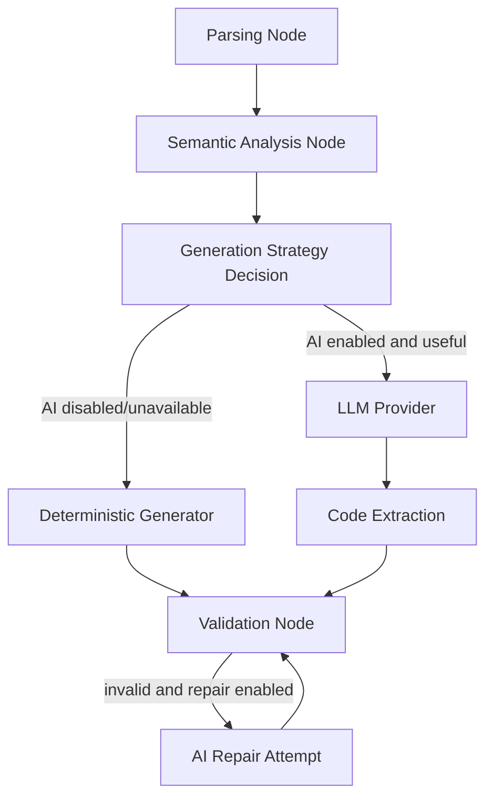

# AI-Assisted Modernization Design

**Spec**: `.specs/features/ai-assisted-modernization/spec.md`
**Status**: Draft

---

## Architecture Overview

A feature adiciona uma camada LLM sem remover o caminho deterministico atual. O grafo continua com quatro etapas obrigatorias, mas o node de generation passa a decidir a estrategia com base em configuracao, sinais de confianca e erros recuperaveis dos nodes anteriores.



---

## Components

### LLM Provider Interface

- **Purpose**: Isolar chamadas AI atras de uma interface testavel.
- **Location**: `app/integrations/llm.py`
- **Interfaces**:
  - `class LlmProvider(Protocol)`
  - `generate(prompt: LlmPrompt) -> LlmResult`
  - `repair(prompt: LlmRepairPrompt) -> LlmResult`
- **Dependencies**: variaveis de ambiente, cliente provider especifico.
- **Reuses**: `build_generation_context`.

### Provider Factory

- **Purpose**: Criar provider real, mock/test provider ou unavailable provider.
- **Location**: `app/integrations/llm.py`
- **Inputs**:
  - `AI_PROVIDER`
  - `AI_MODEL`
  - provider-specific credentials such as `OPENAI_API_KEY`
  - `AI_TIMEOUT_SECONDS`
- **Behavior**:
  - `AI_PROVIDER=disabled` or missing key -> unavailable provider.
  - `AI_PROVIDER=openai` -> OpenAI provider if dependency and key exist.
  - Unsupported provider -> unavailable provider with reportable reason.

### Prompt Builder

- **Purpose**: Montar prompt versionado e auditavel a partir das saidas deterministicas.
- **Location**: `app/integrations/llm.py`
- **Prompt sections**:
  - system instruction: generate Python 3.14 only.
  - source PL/pgSQL.
  - optional schema context.
  - parsed representation summary.
  - semantic findings and risks.
  - translation policy: prefer SQL delegation for risky constructs, pure Python only when safe.
  - output contract: fenced or raw Python module only.

### Generation Strategy

- **Purpose**: Escolher entre AI, deterministic fallback e AI fallback.
- **Location**: `app/nodes/generation.py`
- **Rules**:
  - If `AI_PROVIDER` is configured and provider available, try AI generation first.
  - If parser reports an error or low-confidence marker and AI is available, AI gets priority.
  - If AI fails or returns invalid/no code, use deterministic fallback.
  - Every branch writes `report["stages"]["generation"]["strategy"]`.

### Validation Repair Hook

- **Purpose**: Permitir uma unica tentativa de reparo AI quando codigo gerado por AI falhar `ast.parse`.
- **Location**: `app/nodes/validation.py` or a new `app/nodes/repair.py`
- **Decision**: Keep repair inside validation node for MVP to avoid adding a fifth mandatory graph node. Report it as substage `validation.repair`.

---

## State Changes

Add optional fields to `ModernizationState`:

```python
ai_context: dict[str, Any]
generation_strategy: Literal[
    "ai",
    "ai_repair",
    "deterministic",
    "deterministic_fallback"
]
ai_usage: dict[str, Any]
confidence: dict[str, Any]
```

---

## Error Handling Strategy

| Scenario | Handling | Status |
| --- | --- | --- |
| AI disabled | Use deterministic generator | `sucesso` if validation passes |
| AI provider unavailable | Report unavailable reason, fallback deterministic | `sucesso` or `parcial` |
| Parser recoverable failure | Continue to AI if available, else deterministic fallback | `parcial` if context is weak |
| AI timeout | Fallback deterministic and report timeout | `parcial` or `sucesso` |
| AI returns invalid Python | One repair attempt if enabled | depends on repair |
| Repair invalid | Persist invalid attempt info, fallback or fail | `parcial`/`falha` |

---

## Tech Decisions

| Decision | Choice | Rationale |
| --- | --- | --- |
| Provider shape | Protocol + factory | Keeps graph independent from model vendor. |
| Default behavior | AI disabled unless configured | Keeps local run reproducible without secrets. |
| Fallback policy | Deterministic fallback remains | Avoids hard failure when provider is unavailable. |
| Prompt governance | Versioned prompt metadata in report | Supports review and defense. |
| Repair attempts | Max one | Prevents hidden loops and uncontrolled cost. |

---

## Environment Variables

```text
AI_PROVIDER=disabled|openai
AI_MODEL=gpt-4.1-mini
AI_TIMEOUT_SECONDS=60
AI_REPAIR_ENABLED=true
OPENAI_API_KEY=...
```

Provider and model names should remain configurable. The exact default model can be adjusted during implementation based on available account and current provider support.
