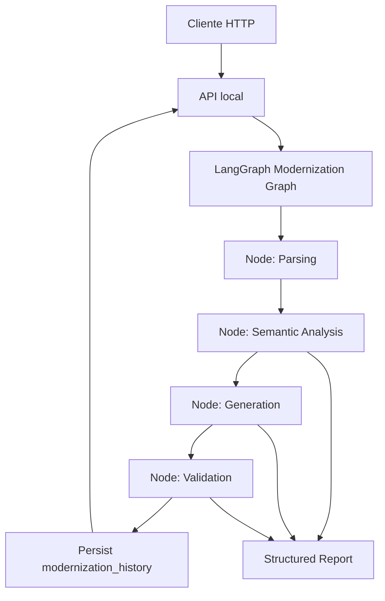

# Pipeline de Modernizacao SQL para Python Design

**Spec**: `.specs/features/pipeline-modernizacao-sql-python/spec.md`
**Status**: Draft

---

## Architecture Overview

Projeto greenfield com separacao entre API, grafo LangGraph, nos da pipeline, persistencia e integracoes externas. O fluxo principal recebe SQL, cria um estado tipado, executa quatro nos obrigatorios, valida o resultado e persiste a execucao em PostgreSQL antes de responder.



Observacao: a skill `mermaid-studio` nao esta instalada nesta sessao, entao o diagrama fica em Mermaid inline.

---

## Proposed Repository Structure

```text
.
+-- app/
|   +-- api/
|   |   +-- server.py
|   |   +-- schemas.py
|   +-- graph/
|   |   +-- state.py
|   |   +-- modernization_graph.py
|   +-- nodes/
|   |   +-- parsing.py
|   |   +-- semantic_analysis.py
|   |   +-- generation.py
|   |   +-- validation.py
|   +-- persistence/
|   |   +-- database.py
|   |   +-- history_repository.py
|   +-- integrations/
|   |   +-- llm.py
|   |   +-- observability.py
|   +-- samples/
+-- db/
|   +-- init.sql
+-- outputs/
|   +-- annexes/
+-- tests/
+-- docker-compose.yml
+-- README.md
```

---

## Components

### API Layer

- **Purpose**: Expor endpoints locais e traduzir requests/responses HTTP para chamadas do grafo.
- **Location**: `app/api/`
- **Interfaces**:
  - `GET /health -> {"status": "ok"}`
  - `POST /modernize -> ModernizeResponse`
- **Dependencies**: grafo LangGraph, repositorio de historico.
- **Reuses**: Nenhum codigo existente; seguir estrutura simples e testavel.

### Modernization Graph

- **Purpose**: Orquestrar os nos obrigatorios usando LangGraph e estado tipado.
- **Location**: `app/graph/modernization_graph.py`
- **Interfaces**:
  - `build_graph() -> CompiledGraph`
  - `run_modernization(request: ModernizeRequest) -> ModernizationState`
- **Dependencies**: nodes, models de estado.
- **Reuses**: Contratos definidos em `app/graph/state.py`.

### Typed State

- **Purpose**: Carregar source SQL, schema opcional, representacao estruturada, achados semanticos, codigo gerado, validacoes, erros e report.
- **Location**: `app/graph/state.py`
- **Core fields**:
  - `source_code: str`
  - `schema_context: str | None`
  - `parsed_representation: dict | None`
  - `semantic_findings: dict`
  - `generated_code: str | None`
  - `validation: dict`
  - `report: dict`
  - `status: Literal["sucesso", "falha", "parcial"]`

### Parsing Node

- **Purpose**: Converter PL/pgSQL em AST, arvore de tokens ou estrutura intermediaria equivalente.
- **Location**: `app/nodes/parsing.py`
- **Interfaces**:
  - `parse_sql(state: ModernizationState) -> ModernizationState`
- **Dependencies**: parser SQL escolhido.
- **Decision point**: Escolher `pglast` se o foco for PostgreSQL/PLpgSQL; `sqlglot` se for mais importante ter AST normalizada multi-dialeto; `sqlparse` apenas se aceitarmos parsing mais superficial.

### Semantic Analysis Node

- **Purpose**: Detectar construcoes relevantes e riscos de traducao.
- **Location**: `app/nodes/semantic_analysis.py`
- **Interfaces**:
  - `analyze_semantics(state: ModernizationState) -> ModernizationState`
- **Detects**: parametros IN/OUT, variaveis, cursores, transacoes, excecoes, CTEs, chamadas a funcoes, `FOR UPDATE`, JSONB, recursao e `RAISE`.

### Generation Node

- **Purpose**: Gerar Python 3.14 a partir da representacao estruturada, achados semanticos e schema opcional.
- **Location**: `app/nodes/generation.py`
- **Interfaces**:
  - `generate_python(state: ModernizationState) -> ModernizationState`
- **Strategy**: Hibrida. Preservar SQL bruto para consultas complexas/transacionais quando isso reduz risco; traduzir controle e formatos Python quando apropriado; registrar decisao por trecho no report.
- **LLM usage**: Permitido, mas prompt deve incluir saidas de parsing/analise. Se LLM nao estiver configurado, implementar fallback deterministico basico ou falha clara.

### Validation Node

- **Purpose**: Verificar o Python gerado e consolidar resultado.
- **Location**: `app/nodes/validation.py`
- **Interfaces**:
  - `validate_generated_code(state: ModernizationState) -> ModernizationState`
- **Checks**: `ast.parse` obrigatorio; lint/check configurado como melhoria; possivel evaluation metric.

### Persistence Layer

- **Purpose**: Persistir cada execucao em PostgreSQL.
- **Location**: `app/persistence/`
- **Interfaces**:
  - `save_history(source_code, generated_code, report, status) -> UUID | int`
- **Dependencies**: PostgreSQL via driver/ORM escolhido.

---

## Data Models

### ModernizeRequest

```python
class ModernizeRequest(BaseModel):
    source_code: str
    schema_context: str | None = None
    metadata: dict[str, Any] = {}
```

### ModernizeResponse

```python
class ModernizeResponse(BaseModel):
    id: str | int | None
    generated_code: str | None
    report: dict[str, Any]
    status: Literal["sucesso", "falha", "parcial"]
```

### modernization_history

```sql
CREATE TABLE modernization_history (
    id UUID PRIMARY KEY DEFAULT gen_random_uuid(),
    source_code TEXT NOT NULL,
    generated_code TEXT,
    report JSONB NOT NULL,
    status VARCHAR(20) NOT NULL CHECK (status IN ('sucesso', 'falha', 'parcial')),
    created_at TIMESTAMP NOT NULL DEFAULT NOW()
);
```

---

## Error Handling Strategy

| Error Scenario | Handling | User Impact |
| --- | --- | --- |
| Empty SQL input | Request validation rejects before graph or records failed attempt if graph starts | Controlled 4xx or failed response |
| Parser limitation | Report limitation; continue only if minimum context exists | `parcial` or `falha` with explanation |
| LLM unavailable | Deterministic fallback or explicit generation failure | No silent success |
| Invalid generated Python | Validation records `ast.parse` error | `parcial` or `falha` |
| PostgreSQL unavailable | API reports infrastructure failure | Execution cannot be considered successful |

---

## Tech Decisions

| Decision | Choice | Rationale |
| --- | --- | --- |
| Primary architecture | Modular Python package with API, graph, nodes and persistence separated | Matches evaluation criteria for code structure and future growth. |
| Translation strategy | Hybrid SQL delegation + Python wrappers | Reduces behavioral risk for complex SQL while still demonstrating modernization decisions. |
| Validation baseline | `ast.parse` mandatory | Explicit minimum requirement and cheap to automate. |
| Bonus priority | QA first, evaluation second, observability third | QA is lower setup risk in a 2-day challenge and supports core scoring. |
| Persistence status values | `sucesso`, `falha`, `parcial` | Matches PDF wording and keeps report explicit. |

---

## Scalability Notes

- Parser/generator interfaces should accept dialect and model/provider parameters for future SQL dialects and LLMs.
- Long-running modernizations can move behind a queue later without changing node contracts.
- Reports should be JSON-serializable and stable to support dashboards, evaluation and tracing.
- Prompt construction should be isolated from graph orchestration to allow caching and model swaps.
