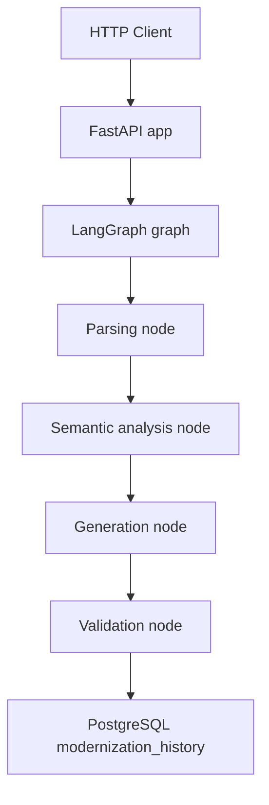

# Desafio Mirante - Pipeline Hibrido SQL para Python


Desafio proposto pela Mirante para atualização de procedures para python 3.14 e usando langgraph e deterministico

Foi feito criado um projeto usando SDD e o codex .specs disponivel para analise das specs geradas.


Pipeline local para modernizar stored procedures PL/pgSQL em wrappers Python 3.14, usando etapas deterministicas e grafo LangGraph.

## Arquitetura

O fluxo recebe uma procedure SQL, executa parsing, analise semantica, geracao e validacao, e persiste o resultado em PostgreSQL.



## Decisoes tecnicas

- **LangGraph**: cada etapa obrigatoria do desafio foi modelada como no do grafo em `app/nodes/`.
- **FastAPI custom app**: `langgraph.json` aponta para o grafo e para a app HTTP com `/health` e `/modernize`, seguindo o suporte do LangGraph CLI para apps Starlette/FastAPI customizadas.
- **Parser**: `sqlparse` foi escolhido para o MVP por simplicidade e por produzir uma arvore de tokens serializavel rapidamente. A analise semantica complementa o parsing com deteccoes especificas de PL/pgSQL. Em producao, `pglast` seria avaliado para uma AST PostgreSQL mais rica.
- **Geracao**: por padrao, a pipeline gera wrappers Python 3.14 que delegam a execucao do SQL ao PostgreSQL. Quando `AI_PROVIDER=openai` e `OPENAI_API_KEY` estao configurados, a geracao chama a camada AI usando contexto estruturado das etapas anteriores.
- **Fallback**: se AI estiver indisponivel ou falhar, a pipeline volta para a geracao deterministica. Se parsing/analise tiver baixa confianca e AI estiver ativa, AI tem prioridade.
- **Validacao**: `ast.parse` e obrigatorio e roda sobre todo codigo gerado.
- **Persistencia**: toda chamada de `/modernize` tenta gravar `source_code`, `generated_code`, `report`, `status` e `created_at` em `modernization_history`.

## Como rodar

Crie o ambiente Python e instale as dependencias:

```bash
python -m venv .venv
.venv\Scripts\activate
python -m pip install -e ".[dev]"
```

Suba o PostgreSQL:

```bash
docker compose up -d postgres
```

Configure variaveis, se necessario:

```bash
copy .env.example .env
```

Para habilitar AI com OpenAI:

```bash
set AI_PROVIDER=openai
set AI_MODEL=gpt-4.1-mini
set OPENAI_API_KEY=sk-...
set AI_REPAIR_ENABLED=true
```

Sem essas variaveis, `AI_PROVIDER=disabled` mantem a execucao local no modo deterministico. O relatorio indica a estrategia usada: `ai`, `ai_repair`, `deterministic` ou `deterministic_fallback`.

Rode a API com Uvicorn:

```bash
uvicorn app.api.server:app --reload --port 8000
```

Ou rode via LangGraph CLI:

```bash
langgraph dev --config langgraph.json --port 2024
```

## Endpoints

Health:

```bash
curl http://localhost:8000/health
```

Modernizacao:

```bash
curl -X POST http://localhost:8000/modernize ^
  -H "Content-Type: application/json" ^
  -d "{\"source_code\":\"CREATE OR REPLACE FUNCTION fn_x() RETURNS INT LANGUAGE plpgsql AS $$ BEGIN RETURN 1; END; $$;\"}"
```

## Samples dos anexos

Os anexos B a F estao em `app/samples/`. Para gerar os outputs:

```bash
python scripts/run_samples.py
```

Os resultados sao escritos em `outputs/annexes/<anexo>/generated.py` e `report.json`.

## Banco de dados

O script `db/init.sql` cria:

```sql
modernization_history(
  id,
  source_code,
  generated_code,
  report,
  status,
  created_at
)
```

Status aceitos: `sucesso`, `falha`, `parcial`.

## Qualidade

```bash
pytest
ruff check .
```

## Limitacoes conhecidas

- `sqlparse` nao entende toda a semantica PL/pgSQL; por isso a deteccao semantica usa heuristicas sobre o source.
- A geracao atual prioriza wrappers auditaveis com SQL delegado, nao uma reescrita completa em Python puro.
- A geracao com AI depende de chave de provider e ainda deve ser revisada tecnicamente; a validacao sintatica nao prova equivalencia comportamental.
- A validacao comportamental contra um banco legado populado ainda nao foi implementada.
- Langfuse/LangSmith nao foi integrado nesta versao inicial.

## Evolucoes com mais tempo

- Trocar ou complementar o parser com `pglast`.
- Adicionar LLM configuravel para gerar wrappers mais ricos a partir do contexto estruturado.
- Criar metricas de evaluation persistidas por execucao.
- Comparar comportamento contra fixtures de banco com dados conhecidos.
- Adicionar observabilidade com Langfuse self-hosted.
